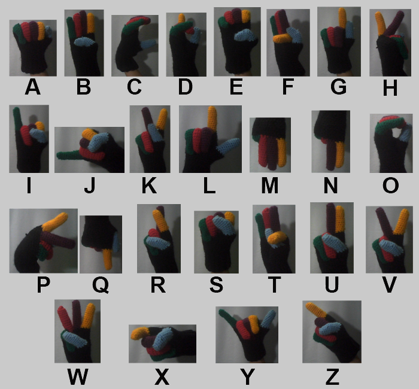

# Projeto_FacensTCC_2020
Esse projeto é um TCC sobre jogo da forca usando Libras, com objetivo de ensina o alfabeto de Libras a partir da gamificação.

Game Jolt: https://gamejolt.com/games/LibrasVC/551341

Gameplay: https://www.youtube.com/watch?v=tC0AmhWwS2w

Demostrando todas as letras: https://www.youtube.com/watch?v=b9_IvxX_Dto

---------

## :spiral_notepad: Sumário:
1. [:clipboard: Recursos necessários](https://github.com/MrYudi/Projeto_FacensTCC_2020/blob/master/README.md#clipboard-recursos-necess%C3%A1rios)
2. [:card_index_dividers: Estrutura do código](https://github.com/MrYudi/Projeto_FacensTCC_2020/blob/master/README.md#card_index_dividers-estrutura-do-c%C3%B3digo)
3. [:thinking: Como jogar](https://github.com/MrYudi/Projeto_FacensTCC_2020/blob/master/README.md#thinking-como-jogar)
4. [:electron: Créditos](https://github.com/MrYudi/Projeto_FacensTCC_2020/blob/master/README.md#electron-cr%C3%A9ditos)

-----------------------------------

## :clipboard: Recursos necessários:
 1. Uma *webcam*; :camera:
 2. Python 3.6.8; :snake:
 3. As bibliotecas de Python que pode ser encontrado no *requirements*, não é necessário as duas biblioteca ao mesmo tempo;
    - requirements.txt para utilizar a Rede Neural via CPU;

    ```
    pip install -r requirements.txt    
    ```

    - requirements_gpu.txt para utilizar a Rede Neural via GPU.

    ```
    pip install -r requirements_gpu.txt
    ```
    
 4. Fundo Branco (pode ser um pano branco ou uma parede branca);
 5. Luva com os dedos coloridos, conforme a imagem abaixo. :gloves:
 
 
 
-----------------------------------

## :card_index_dividers: Estrutura do código:
A estrutura do código pode ser organizada em duas categorias:
 - **Jogo da forca** (o objetivo principal deste projeto)
 - **Rede Neural** (script de treinamento, coleta de dados, testes com a rede neural e etc...)

### Jogo da forca
**JogoDaForca/JogoDaForca.py:** O código principal do jogo, ele deve ser executado para iniciar o jogo.

**JogoDaForca/CameraDeduz.py:** Um código auxilia usado pelo JogoDaForca/JogoDaForca.py, utilizado para enviar uma resposta da rede neural, no caso qual sinal do alfabeto de Libras foi representado na camera. 

**JogoDaForca/imagens/..:** Imagens utilizadas no jogo.

### Rede Neural

**redeNeural/Treinamento.py:** Script do treinamento da Rede Neural (SqueezeNet) e o local onde será localizado o arquivo da Rede Neural, incluído gráficos de perca e acurácia.

O Dataset utilizado no treinamento pode ser encontrado no **Dataset_TodasLetrasComLuvaEFundoBranco.rar**

**salvaDataset.py:** Captura as imagens utilizadas para o treinamento da Rede Neural e já realiza a organização dela.

**predict.py:** Prediz o resultado da imagem, usado afins de teste exclusivamente para Rede Neural.

**matriz.py:** Um script para gerar uma matriz de confusão, afins de avaliar a rede neural.

-----------------------------------

## :thinking: Como jogar:
**Antes de iniciar, verifique se o arquivo RedeNeural/libras-alfabeto-model.h5** se encontra no local, caso não esteja descompacte **RedeNeural/RedeNeural_fundoBrancoComLuvas.rar** dentro da pasta **RedeNeural**.

Para iniciar deve ser executado o **JogoDaForca/JogoDaForca.py**.

### Menu Principal:
O menu principal do jogo, onde o usuário terá duas escolhas:
- Sorteia uma palavra pelo sistema. 
- Digita uma palavra, pode ser utilizado para teste e/ou como um segundo jogador, após o click, a palavra deve ser digitado no console. É recomendando uma palavra com no máximo 10 letras, não deve ser inserido letras com acentos e Ç.


### Jogo: 
Nesta tela, o usuário poderá visualizar suas tentativas (pela imagem), quais letras acerto ou errou. Quando usuário for tenta deduzir uma letra, deve ser apertado o botão **"Tentar"**, que irá direciona o usuário para tela Tentativa.

  

O usuário pode desistir da partida apertando **"Escape"**.

### Tentativa:
Nesta tela, o usuário realiza o sinal do alfabeto de Libras. Para iniciar o processo de análise é necessário que o usuário pressione **"Enter"** e mantenha o sinal (dentro do quadrado verde) até a analise ser concluída. Caso a letra não corresponde com sinal feito, é possível tenta de novo pressionando **"Enter"**. Caso ao contrario, aperte **"Escape"** para retorna.

 

A imagem abaixo contém exemplos do alfabeto de Libras:



--------------

## :electron: Créditos: 
Projeto desenvolvido por:
- :man_technologist: [Gabriel Yudi Sanefugi](https://github.com/MrYudi) 
- :woman_technologist: [Eloá Souza Camillo](https://github.com/EloaCamillo)

Imagens de JogoDaForca/imagem/0.png até JogoDaForca/imagem/8.png desenvolvido por:
- :woman_artist: [Mary Kimiko Zaima](https://www.instagram.com/marykimiko580/)
